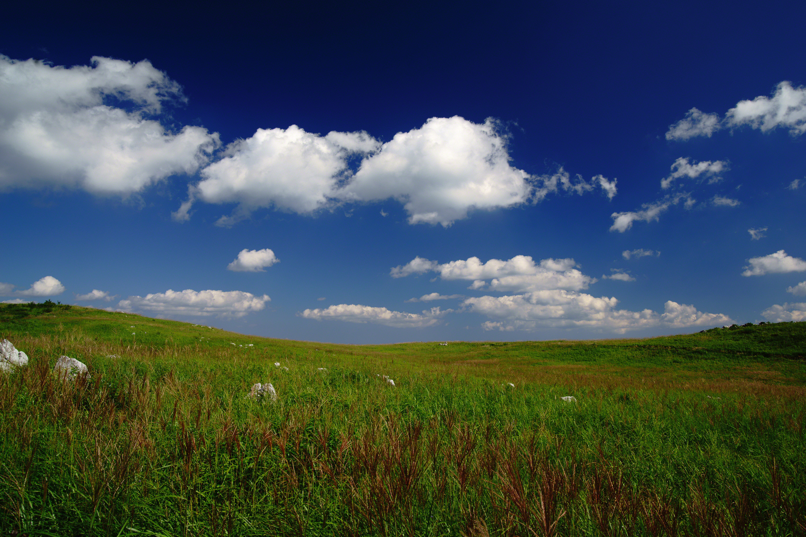
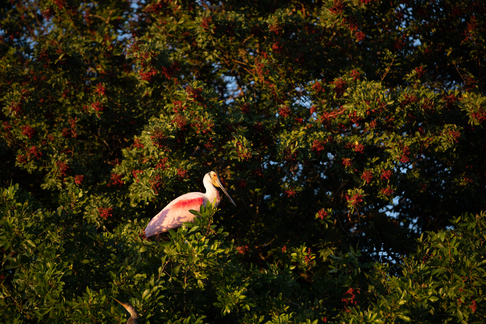
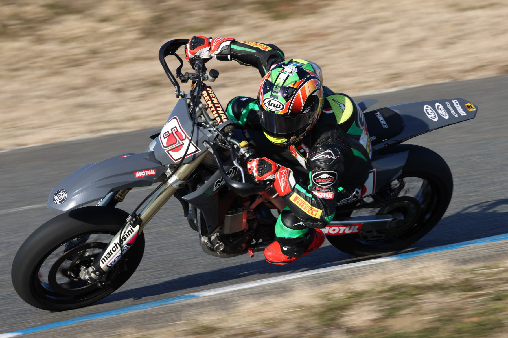
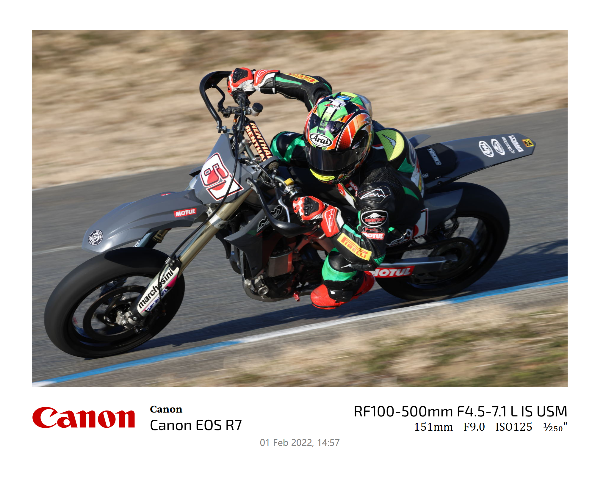
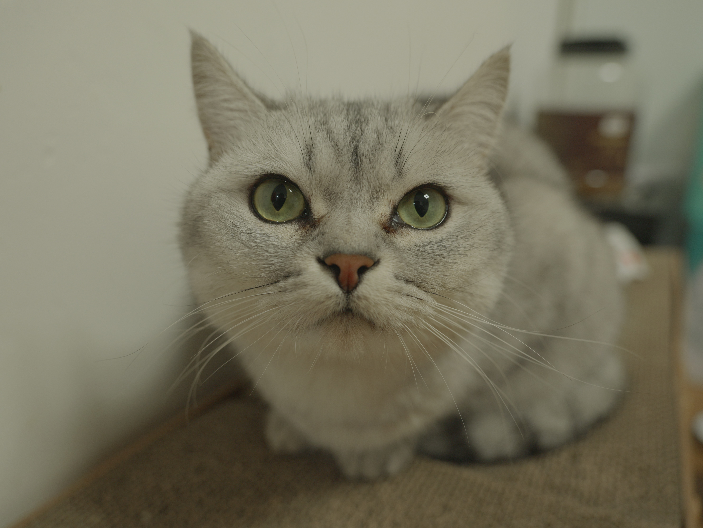

# Phototags

## 目录
[toc]

## Welcome Home

<center class="half">


</center>

<center class="half">


</center>

<center class="half">


</center>

<center class="half">


</center>

## 项目说明

纯纯写着玩的~

- 所有附加信息，Logo部分全部采用官方提供的图片和SVG（在根目录下`sprites/outputs`文件夹），在各大官网中均可找到。为了清楚地标明，部分Logo采用了简单的反色程序处理。这部分由OpenCV软件包提供支持。**由于Logo有着版权信息，请保证加上了水印的照片和各厂商官方没有任何关系，并且仅用于个人用途，严禁用于商业目的，除非已经取得了官方的授权许可。**
- 其余所有字体，归属于微软的部分，由于没有单独提取字体文件进行分发，一般不会有版权问题，可以放心使用。其余的字体通过探索[Google Fonts](https://fonts.google.com/)和询问GPT得来。由于Google Fonts上的字体开源免费，也无需担心。除了使用Logo作为图片外，其余的水印部分均通过逻辑编程而来。
- 本程序会联网下载软件包、软件库，但不会以任何形式上传用户的个人数据，盗取个人信息。

## 功能

为你的照片添加水印。记录下当时的精彩瞬间，你使用的相机、镜头、主要参数。

- 所有相关信息也可以从“属性”菜单中看出。
- 当镜头或部分参数缺失时，显示会不完整。但是排版应该不会出现问题。

### 使用

导航到`main.py`中， `add_metadata("./inputs", "./outputs")`函数的第一个参数`"./inputs"`为输入图片的文件夹；第二个参数`"./outputs"`为输出图片的文件夹。程序运行过程中会产生`index.html`的临时文件。需要保证所有图片均为常见的格式（jpg, png等），使用封装格式（avif, rw2等）等可能导致程序无法读取图片信息。

运行：

```
python main.py
```

## 技术说明

1. PIL和OpenCV提供图像处理支持：读写、缩放、颜色变换等等。PIL还提供了水印信息的读取，这部分程序上叫EXIF，是照片除了原本数据外挂载的属性信息。
2. 水印排版和风格化使用HTML和CSS完成。
3. 为了给网页截图，使用了业界流行的自动化测试工具Selenium。有点杀鸡用牛刀，但是确实没有更好的替代方案了。

### 目前的问题

1. 当时本来有个想法，用边缘检测算法动态读取相机外形为相机制作Logo，但是没能成功。这个确实难做，感觉不是调点参数就能出来的。
2. 输出的字体大小为绝对大小，不会随着图片尺寸改变。图片越大，看上去水印越小。这一点有两个解决方案，一个是把字体改相对（跟着照片缩放），另一个就是把照片改绝对（固定照片的尺寸，例如固定长边为3000px）。
3. 用户不友好。这个形式就多了，可以命令行，我也可以写一个WebUI。看情况~
~~4. 不知道google字体库国内能不能访问~~